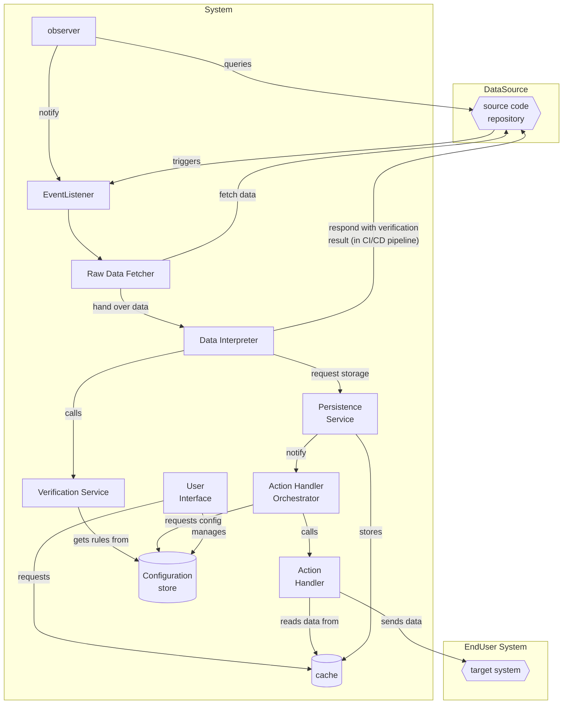

# Architecture View

## Introduction

The software project is an implementation of a distributed data-as-code management system in a cloud-native and DevOps driven fashion.

Hereby data is

* handled like source code,
* checked and managed via CI/CD technology,
* can be distributed via different repositories and
* later be queried in a database-native way and
* further processed with standard tooling or
* exported in standard formats.

This enables distributed management of **meta-data** and **master-data** in a well-known environment without the need of central tooling or installation of client applications that needs to be trusted.
This allows to work with different audiences that are used to work with source code management.
With the flexibility to handle different file formats also IT-professionals can be targeted.

With CI/CD tooling direct feedback about the data can be provided.
The data is located where the development team is working on the code and all data is directly present.

This should also be seen as a paradigm shift, where the team is enabled to handle the data without the need of dedicated experts.
E.g.: the meta-data of an application like "minimum required OS version" can be managed by the team and does not need an architect to enter this information in an architecture-management-tool, a CMDB or mail it to the operations-team for further internal documentation.
This shared responsibility should lead to better and more accurate data.

By taking over the distributed data into a queryable centralized system we tackle the problems of distributed information and do the data gathering for further processes.
As an example: by taking over all package-manager files of a distributed system vulnerability analysis can be started, based on the dependencies used (like package.json in node.js projects tracking npm-package dependencies; consider also other package managers like nuget in csproj, mvn in pom.xml,... ).

## UseCases and Stakeholders

* data gathering of meta-data about applications in different repositories (e.g. responsible team in case of an incident) is important for multiple management and architectural decisions of companies that have an own IT team with custom software development or that utilize highly customized tooling.
* master-data management based on DaC that is decentralized across different systems and repositories (e.g. a json-adapter micro-service adds "json" as selectable format in table "exportFormats") shifts the amount of requests from database teams to a highly automated process that can be implemented with an approval process based on CI/CD.
* dependency analysis based on package-manager configurations (e.g.: is any system using a deprecated version of X, Y, Z) is crucial for security departments that need to plan further actions strategically (or sometimes also very fast).
* in case we can assure that required meta-info is inserted into repositoy, we are able to have a good overview on which micro-services are in place at all.
  * Showing dependencies would be a great extension that enables an architectural overview and dashboard making the implementation process easier.

## Quality Goals

* **reliability**
  The system is designed to be high available and fast so that it is a perfect solution to be used as infrastructure component for further data processing.
* **traceability**
  data source and editor (based on credentials) are clear and are taken over including all timestamps available, so that we can make it comprehensible how the data results are collected.

* **security**
  by working with highly sensitive data it is self-evident that there is a focus on protecting the data even if the system is not the source system of the data.

## Solution

### Constraints

By implementing the solution it was clear that we want to have a **future-proof** solution that is based on **cloud-native** technologies. The solution sets up on **open-source** tooling and will not utilize any commercial components or components that force the project into any license conflicts or require payment for end-users so the base-project can be used **free** of charge. The base project will be licensed under **MIT license** and the project team is willing to take pull requests for continuous improvements.

### Decisions

Repositories in DaC-approach can already be seen as a database, that is why we can recreate the state completely from the source system (even if probably not in the same order). That is why we name our data store only a **cache**, because the real source of truth is always the repository and no additional data is allowed to be entered in the cache. In case the data wants to be extended we need to implement the extension also in a DaC fashion.

### Architecture

Hereby we have repository and format specific solutions:

* source code repository: git, svn, ...

* event listener is a component that gets called (CI/CD process or webhook)
* observer checks in a defined period of time if changes occured
* the data-fetcher gets the data after the trigger
* the data-interpreter is format specific related to: json, xml, csv, ... and converts to data into a common data format to query

* verification service checks against the defined schema (from config store)
* persistence layer writes the data to the cache
* action handler orchestrator calls different actions dependent on configured behaviours that will hand over the data to a defined target system (e.g. export current state in a database)

* the UI can be used to view the cache and to configure the system

## Core-Team

* [@starkeeny](https://www.github.com/starkeeny)
* [@Creat1v](https://www.github.com/Creat1v)
* [@cchriso](https://www.github.com/cchriso)
